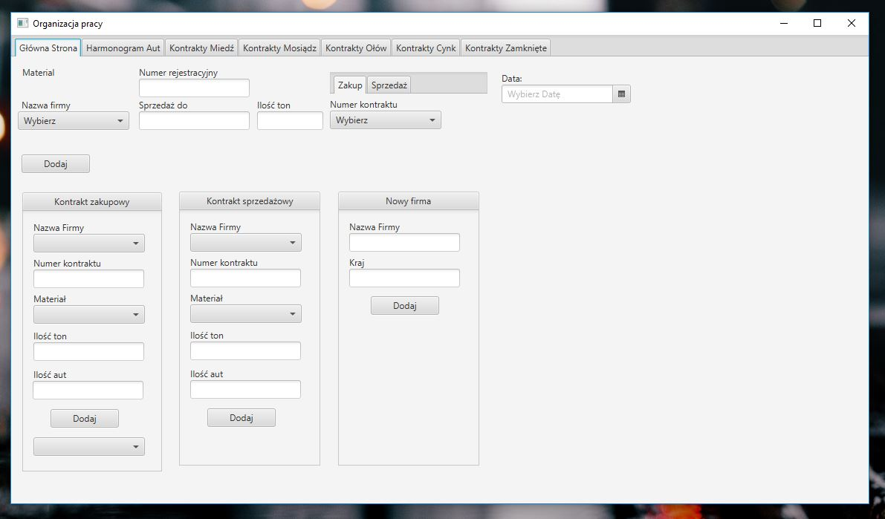
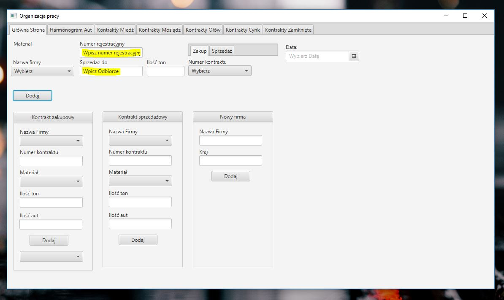
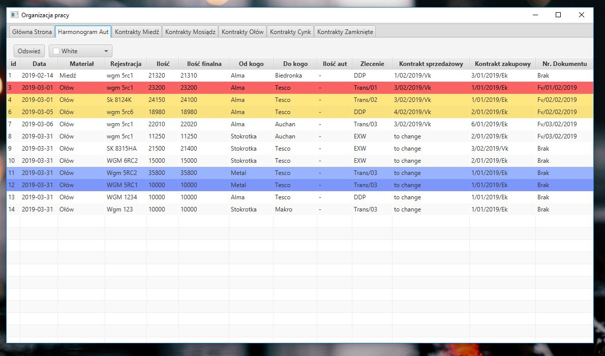
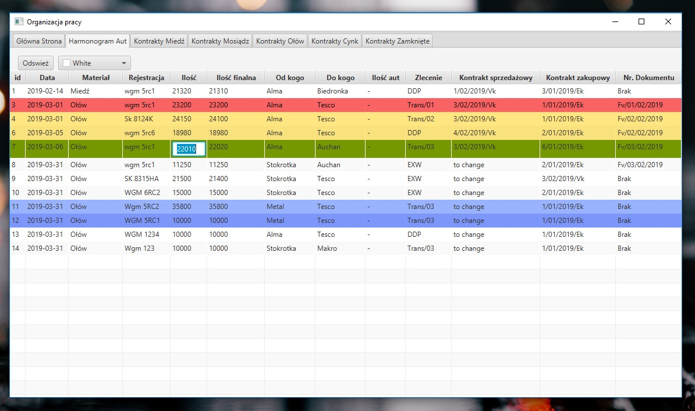
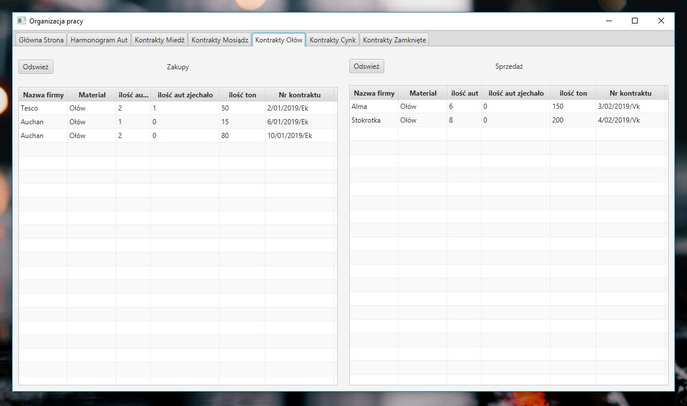
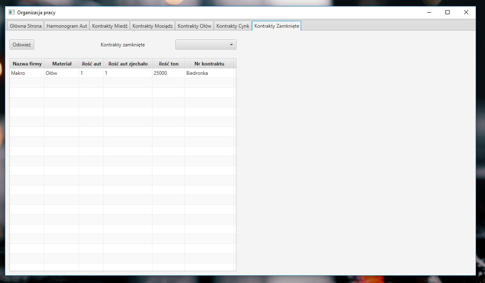

# Work software Manager

## Table of contents
* [General info](#general-info)
* [Screenshots](#screenshots)
* [Technologies](#technologies)
* [Features](#features)
* [Status](#status)
* [Setup](#setup)
* [Inspiration](#inspiration)
* [Contact](#contact)

## General info
This application created for better planning, organize deliveries, contracts realization, better knowledge about amount delivered etc. Generally speaking, this application help me in my current work as a Trader.

## Screenshots
Main view for adding Truck, Customer, Contracts

Every field has validation, preventing sent null to DB

Schedule of deliveries and shipments

Every table has editable cells

Material tab with contracts for better control of open contracts

Final close tab with every Contracts

## Technologies
* Java - 1.8
* JavaFX - version 2.0.5
* Lombok
* Maven
* Junit - version 4.12
* Mockito - version 1.10.19
* Hibernate - version 5.3.7
* H2 Database - version 1.4.197

## Features
List of features ready and TODOs for future development

* Adding delivered or sent truck details
* Schedule of deliveries and shipments
* Editable tables with sorting option
* Tab with specific material and realized contracts
* Simple adding customers
* Creating contracts

To-do list:

* Calendar for plan future deliveries
* Financial result of transaction
* Contracts with a price and fixation on London metal exchange
* History of contracts for customer

## Status
Project is: _in progress_
A lot of things to do and improvement.
## Setup
MySQL Database located IP:127.0.0.1 port:3306
## Inspiration
Project inspired by big and expensive programs which cost is to high and I wanted to make the same program by myself.
## Contact
Created by Dawid Paprocki [Linkedin](https://www.linkedin.com/in/dawid-paprocki/)
